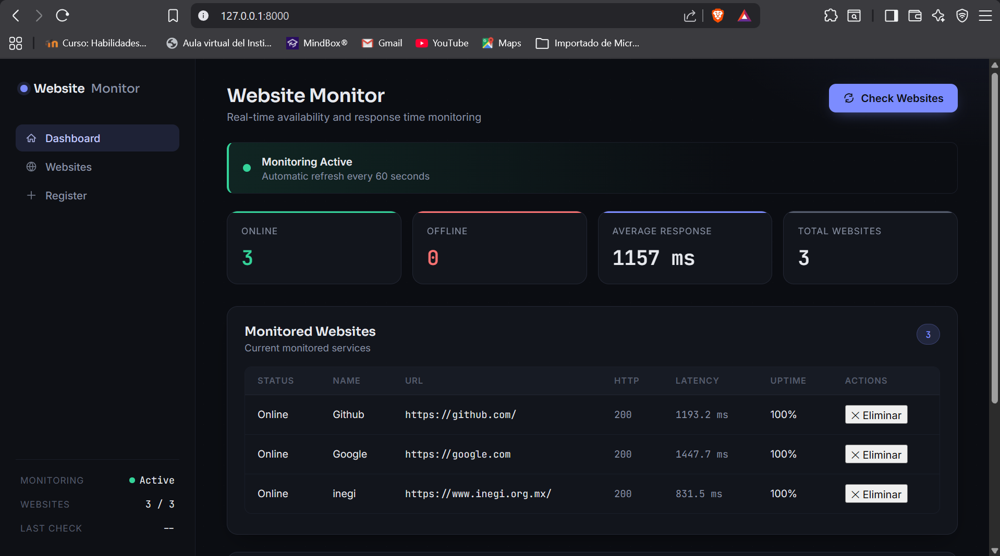
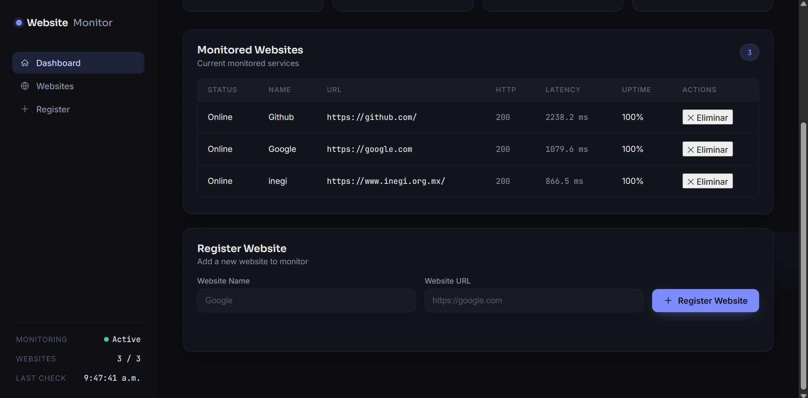

# Monitor de Sitios Web

Monitor de Sitios Web es una aplicación web desarrollada con Python y FastAPI que permite supervisar la disponibilidad de sitios web, medir su tiempo de respuesta, calcular el porcentaje de uptime y mantener un historial de verificaciones utilizando SQLite.

El proyecto fue desarrollado con el objetivo de aplicar conceptos de desarrollo backend, consumo de servicios HTTP, diseño de APIs REST y persistencia de datos, siguiendo una arquitectura modular y buenas prácticas de desarrollo.

---

## Tabla de Contenido

- Descripción
- Características
- Arquitectura
- Tecnologías
- Estructura del Proyecto
- Instalación
- Uso
- API
- Capturas
- Desafíos Técnicos
- Aprendizajes
- Mejoras Futuras
- Autor
- Licencia

---

## Descripción

La aplicación permite registrar múltiples sitios web y verificar periódicamente su disponibilidad mediante solicitudes HTTP.

Para cada sitio monitoreado se obtiene información como:

- Estado de disponibilidad
- Código de respuesta HTTP
- Tiempo de respuesta
- Porcentaje de uptime
- Fecha del último chequeo
- Historial completo de verificaciones

Toda la información se almacena en una base de datos SQLite para mantener un registro persistente del monitoreo.

---

## Características

- Registro y eliminación de sitios web
- Verificación automática mediante solicitudes HTTP
- Medición del tiempo de respuesta
- Cálculo del porcentaje de uptime
- Historial persistente de verificaciones
- Dashboard responsive
- Actualización automática cada 60 segundos
- API REST documentada con Swagger
- Indicadores visuales de estado y latencia

---

## Arquitectura

                    +----------------------+
                    |     Frontend Web     |
                    | HTML / CSS / JS      |
                    +----------+-----------+
                               |
                         HTTP REST API
                               |
                    +----------v-----------+
                    |       FastAPI        |
                    +----------+-----------+
                               |
             +-----------------+-----------------+
             |                                   |
      HTTP Checker                     SQLite Database
             |                                   |
          httpx                        Sitios + Historial

---

## Tecnologías

| Tecnología | Descripción |
|------------|-------------|
| Python 3.12 | Lenguaje principal |
| FastAPI | Framework Backend |
| Uvicorn | Servidor ASGI |
| httpx | Cliente HTTP |
| SQLite | Base de datos |
| Pydantic | Validación de datos |
| HTML5 | Frontend |
| CSS3 | Estilos |
| JavaScript | Interfaz dinámica |

---

## Estructura del Proyecto

monitor-sitios-web/

├── backend/

│   ├── main.py

│   ├── checker.py

│   ├── database.py

│   └── requirements.txt

├── frontend/

│   ├── index.html

│   ├── style.css

│   └── app.js

├── capturas/

│   ├── dashboard.png

│   ├── historial.png

│   └── api.png

└── README.md

---

## Instalación

Clonar el repositorio

```bash
git clone https://github.com/Mau12701/monitor-sitios-web.git
```

Entrar al proyecto

```bash
cd monitor-sitios-web/backend
```

Crear un entorno virtual

```bash
python -m venv venv
```

Windows

```bash
venv\Scripts\activate
```

Linux / macOS

```bash
source venv/bin/activate
```

Instalar dependencias

```bash
pip install -r requirements.txt
```

Ejecutar el servidor

```bash
uvicorn main:app --reload
```

Abrir en el navegador

```
http://localhost:8000
```

Documentación de la API

```
http://localhost:8000/docs
```

---

## Uso

1. Registrar uno o más sitios web desde el dashboard.
2. Ejecutar una verificación manual o esperar el chequeo automático.
3. Consultar el estado actual, tiempo de respuesta y porcentaje de uptime.
4. Revisar el historial de verificaciones para cada sitio.

---

## API

| Método | Endpoint | Descripción |
|---------|----------|-------------|
| GET | / | Dashboard principal |
| GET | /api/sitios | Lista todos los sitios |
| POST | /api/sitios | Agrega un nuevo sitio |
| DELETE | /api/sitios/{id} | Elimina un sitio |
| POST | /api/chequear | Verifica todos los sitios |
| POST | /api/chequear/{id} | Verifica un sitio específico |
| GET | /api/historial/{id} | Historial de verificaciones |

---

## Ejemplo de Respuesta

```json
[
    {
        "id": 1,
        "url": "https://google.com",
        "nombre": "Google",
        "ultimo_chequeo": {
            "online": true,
            "status_code": 200,
            "tiempo_ms": 143.5
        },
        "uptime": 99.8
    }
]
```

---

## Capturas

### Dashboard



### Historial




---

## Desafíos Técnicos

Uno de los principales retos fue diseñar un sistema de monitoreo que permitiera verificar múltiples sitios de manera eficiente y registrar cada resultado sin afectar el rendimiento de la aplicación.

Para ello se implementó una arquitectura modular donde la lógica de verificación HTTP está separada de la API REST y de la capa de persistencia, facilitando el mantenimiento y la escalabilidad del proyecto.

También se implementó el cálculo del porcentaje de uptime a partir del historial de verificaciones almacenado en SQLite.

---

## Aprendizajes

Durante el desarrollo del proyecto se aplicaron conocimientos relacionados con:

- Desarrollo de APIs REST con FastAPI
- Consumo de servicios HTTP utilizando httpx
- Validación de datos con Pydantic
- Persistencia de datos con SQLite
- Manejo de errores de red y timeouts
- Comunicación entre frontend y backend mediante Fetch API
- Organización modular de proyectos Python

---

## Mejoras Futuras

- Monitoreo automático mediante tareas programadas
- Notificaciones por correo electrónico
- Alertas mediante Telegram o Discord
- Exportación de reportes PDF y CSV
- Dashboard con gráficas de disponibilidad
- Autenticación de usuarios
- Despliegue utilizando Docker
- Soporte para WebSockets y actualización en tiempo real

---

## Autor

Mauricio Escobar Sanchez

GitHub

https://github.com/Mau12701

Correo

mauriescobar127@outlook.com

---

## Licencia

Este proyecto se distribuye bajo la licencia MIT.
